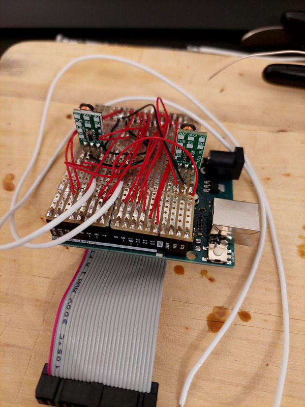
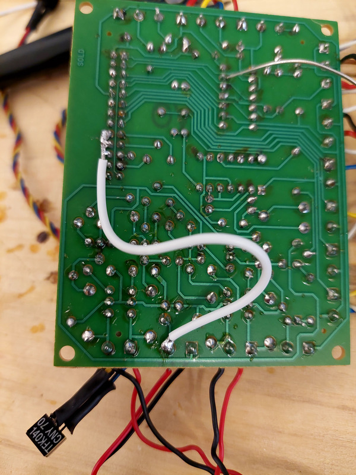

# Monty <-> Arduino adaptation notes

## Problem

Monty microrobot is an old project that was available in France; it is a robot based on a [PIC16F84](https://www.microchip.com/en-us/product/PIC16F84) and programmable through a parallel DB25 PC port. This is where issues start:
- The compiler for the 16F86 provided with the robot is an old MS DOS app. New toolchains that can be found on the internet (like [MPLAB X IDE](https://www.microchip.com/en-us/tools-resources/develop/mplab-x-ide)) don't seem to provide an interface to program through parallel port (obviously). Trying to emulate DOS with parallel port pass-through did not work neither, likely because the passthrough feature from [DOSBox-X](https://dosbox-x.com/) is targetted for printers only (no general purpose).
- There are not a lot of machines available with DB25 port. Some DB25 to USB adapters were tried, without success neither

## "Solution"

The short and fast path selected here is to replace the whole power+PIC16F84 board with an [Arduino Uno](https://docs.arduino.cc/hardware/uno-rev3) with a "hat" adaptater card with a power supply & 26-pin connector.
The hat would contain:
- a 26 pins connector (same form factor as the previous board) to do the interconnection with the power card (linked to the various sensors)
- a dedicated power supply to provide the 5v and 9v inputs needed by the power card

Logical digital inputs and outputs consist of the same 5v logical levels, so it's quite straightforward to do the modification regarding the I/O.

## Adaptater card pin mapping


The limitation of using the Uno arduino card is that there are only 14 digital pins (so 12 if we want to exclude tx/rx pins). We chose to put aside pin 25 `RA24`, which was not really used in the original project. An alternative could be to use a shift register like `74HC595` to have additional digital pins available, but it was not worth it as a first step.


## Other cards modifications

### Adaptater card prototype

For the test, 5v and 9v inputs are fed by two DC voltage regulators (12v to 9v and 12v to 5v) and a AC to DC converter in front of those. This allows to reuse the preconised 12VAC from the original project. This setup seems a bit fragile and I will update here once I have a better approach.

- [ ] TODO Add a full schematic here with blueprints on how to add a 5v + 9v supply on the same hat once fully designed



#### Power card supply modification

Pin 18 to 25 of the PIC 'application' bus are somehow marked for 13.8V supply on the doc but used nowhere... A simple bridge from those pins to pin 2 of `J13` (V+ for the wheels) allows us to pass both +5v and +9v from our "hat" adaptater card directly to the power card.



## Test code

This simple code allows to test all inputs and outputs of the robot to validate all sensors are working as expected:

```C++
/* 0: white, 1: triggered or unknown */
#define REFLEX_SENSOR_RIGHT 2
#define REFLEX_SENSOR_LEFT 3

/* 1: hit */
#define BUMPER_RIGHT 4
#define BUMPER_LEFT 5

/* Light sensors -> 1: dark, 0: light */
#define TTL1 6
#define TTL2 7

/* Movement sensor: 1: none, 0: activity */
#define TTL3 8

/* Sound: 0: none, 1: activity+ */
#define TTL4 9

#define MOT_RIGHT_1 13
#define MOT_RIGHT_2 12
#define MOT_LEFT_1 11
#define MOT_LEFT_2 10

void setup() {
  pinMode(BUMPER_LEFT, INPUT);
  pinMode(BUMPER_RIGHT, INPUT);
  pinMode(REFLEX_SENSOR_LEFT, INPUT);
  pinMode(REFLEX_SENSOR_RIGHT, INPUT);
  pinMode(TTL1, INPUT);
  pinMode(TTL2, INPUT);
  pinMode(TTL3, INPUT);
  pinMode(TTL4, INPUT);
  pinMode(MOT_LEFT_1, OUTPUT);
  pinMode(MOT_LEFT_2, OUTPUT);
  pinMode(MOT_RIGHT_1, OUTPUT);
  pinMode(MOT_RIGHT_2, OUTPUT);

  Serial.begin(9600);
}

void loop() {
  int left = digitalRead(BUMPER_LEFT);
  Serial.println(left);
  int right = digitalRead(BUMPER_RIGHT);
  Serial.println(right);
  int rleft = digitalRead(REFLEX_SENSOR_LEFT);
  Serial.println(rleft);
  int rright = digitalRead(REFLEX_SENSOR_RIGHT);
  Serial.println(rright);
  int ttl1 = digitalRead(TTL1);
  Serial.println(ttl1);
  int ttl2 = digitalRead(TTL2);
  Serial.println(ttl2);
  int ttl3 = digitalRead(TTL3);
  Serial.println(ttl3);
  int ttl4 = digitalRead(TTL4);
  Serial.println(ttl4);
  if(left)
  {
    digitalWrite(MOT_LEFT_1, HIGH);
    delay(1000);
    digitalWrite(MOT_LEFT_1, LOW);
    delay(100);
    digitalWrite(MOT_LEFT_2, HIGH);
    delay(1000);
    digitalWrite(MOT_LEFT_2, LOW);
  }
  if(right)
  {
    digitalWrite(MOT_RIGHT_1, HIGH);
    delay(1000);
    digitalWrite(MOT_RIGHT_1, LOW);
    delay(100);
    digitalWrite(MOT_RIGHT_2, HIGH);
    delay(1000);
    digitalWrite(MOT_RIGHT_2, LOW);
  }

  delay(1000);
  Serial.println("--------");
}

```

- [ ] TODO Provide higher level helpers and a funnier robot code

## Areas of improvement

- Using an `ESP8266` with Wifi would allow to make the robot remotely available/programmable
- Add a `74HC595` shift register to have more digital pins, especially because the robot has only few ways to interact with outer world OOB (wheels to move, a simple "buzzer" speaker, and its arm). Having more pins would allow to keep all sensors and add more outputs.
